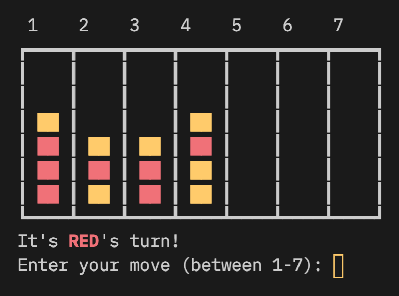

# Connect Four AI



`four-ai` is a multithreaded neural network training system that utilizes [genetic algorithm](https://en.wikipedia.org/wiki/Genetic_algorithm). Everything related to neural networks was implemented from scratch, including matrix multiplication, neural network forward pass, and crossover + mutation.

This is a proof of concept for how a genetic algorithm library could be implemented with rust in the future. 

<br>
<br>

## Usage

```bash
cargo run --release
```

Note: the `--release` flag is **IMPORTANT**! Without the optimizations provided by it, training will be much slower.

